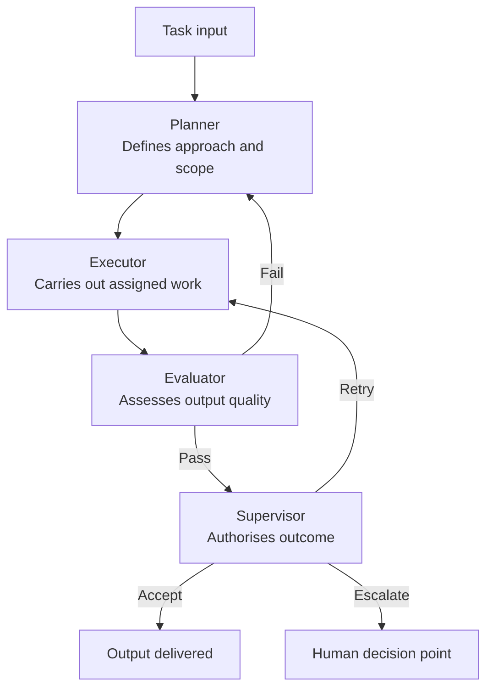

# Multi-Agent Governance Framework

A structured framework for defining roles, decision authority, escalation logic, and accountability in multi-agent AI systems.

---

## Why this exists

Multi-agent systems often fail not because individual agents are weak, but because the system around them is poorly governed.

Common failure modes:
- Unclear agent roles lead to competing or redundant decisions
- Missing escalation paths cause infinite loops or silent failures
- Fragmented ownership means no one is accountable when the system misbehaves
- Poor debuggability makes it impossible to trace which agent made which decision

---

## Governance structure

---

## What's covered

| Topic | Document |
|-------|---------|
| Agent role definitions | `docs/agent-roles.md` |
| Decision flow between agents | `docs/decision-flow.md` |
| Escalation logic and stop conditions | `docs/escalation-logic.md` |
| Accountability mapping | `docs/accountability-mapping.md` |
| Design rules and guardrails | `docs/design-rules.md` |
| Governance review checklist | `templates/governance-review-checklist.md` |
| Worked example: research assistant | `examples/research-assistant-system.md` |

---

## Who this is for

- Builders of LLM workflows and agent pipelines
- AI platform and systems engineers
- Product managers designing agentic systems
- Governance, operations, and risk leads

---

## Design principle

> A multi-agent system should behave like a controlled operating model, not a collection of loosely connected prompts.

---

## Companion repositories

- **[Agent System Simulator](https://github.com/simaba/agent-system-simulator)** — runnable implementation of the roles and patterns described here
- **[Multi-Agent Orchestration Patterns](https://github.com/simaba/multi-agent-orchestration-patterns)** — structural interaction patterns to use within this governance framework

---

## Related repositories

This repository is part of a connected toolkit for responsible AI operations:

| Repository | Purpose |
|-----------|---------|
| [Enterprise AI Governance Playbook](https://github.com/simaba/enterprise-ai-governance-playbook) | End-to-end AI operating model from intake to improvement |
| [AI Release Governance Framework](https://github.com/simaba/ai-release-governance-framework) | Risk-based release gates for AI systems |
| [AI Release Readiness Checklist](https://github.com/simaba/ai-release-readiness-checklist) | Risk-tiered pre-release checklists with CLI tool |
| [AI Accountability Design Patterns](https://github.com/simaba/ai-accountability-design-patterns) | Patterns for human oversight and escalation |
| [Multi-Agent Governance Framework](https://github.com/simaba/multi-agent-governance-framework) | Roles, authority, and escalation for agent systems |
| [Multi-Agent Orchestration Patterns](https://github.com/simaba/multi-agent-orchestration-patterns) | Sequential, parallel, and feedback-loop patterns |
| [AI Agent Evaluation Framework](https://github.com/simaba/ai-agent-evaluation-framework) | System-level evaluation across 5 dimensions |
| [Agent System Simulator](https://github.com/simaba/agent-system-simulator) | Runnable multi-agent simulator with governance controls |
| [LLM-powered Lean Six Sigma](https://github.com/simaba/LLM-powered-Lean-Six-Sigma) | AI copilot for structured process improvement |

---

*Shared in a personal capacity. Open to collaborations and feedback — connect on [LinkedIn](https://linkedin.com/in/simaba) or [Medium](https://medium.com/@bagheri.sima).*
